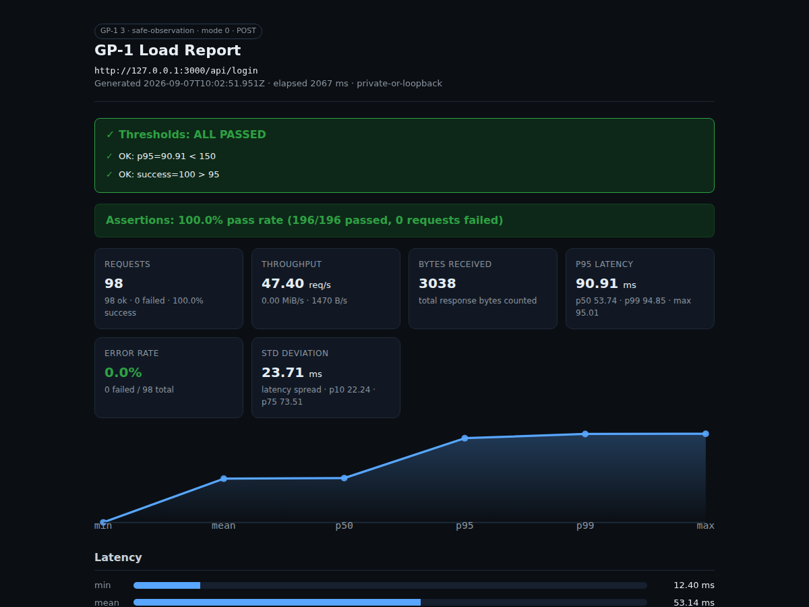

# GP-1

> **GP-1 is a safe, reproducible HTTP load-testing and service-observation toolkit for localhost, private networks, and authorized staging environments.**

[](https://github.com/Gopyr/GP-1/actions/workflows/ci.yml) [](https://nodejs.org/) [](LICENSE)

GP-1 is the **main project** in the Gopyr profile and the serious successor to the old one-file stress-test experiment. It is designed to make ambitious performance and resilience experiments easy to scope, easy to repeat, and difficult to run accidentally at an uncontrolled scale.

## What makes GP-1 different

| Principle | Implementation |
| --- | --- |
| **Bounded by default** | Duration, concurrency, timeout, interval, ramp stages, and total request limits are validated before a run. |
| **Safe target handling** | Loopback and private targets work by default. A public hostname requires an explicit `--allow-public` flag and authorization. |
| **Any HTTP method** | GET/POST/PUT/PATCH/DELETE with request bodies, custom headers, bearer/basic auth, and cookies. Response bodies are counted for bytes, never persisted. |
| **Assertions & gates** | Per-request assertions (`--assert-status`, `--assert-latency`) and post-run thresholds (`--threshold p95<500`) that fail the run and exit non-zero for CI. |
| **Evidence over claims** | Reports include success/error rate, throughput, MiB/s, status codes, errors, p5-p99 latency, std deviation, a latency histogram, and a distribution chart. |
| **Progressive load** | `--ramp "5:10s,50:30s,5:10s"` ramps concurrency across stages instead of a flat rate. |
| **Reproducible experiments** | The repository includes a local demo server and a documented baseline procedure. |
| **Honest scope** | This is a single-process load generator, not a distributed platform, DDoS tool, scanner, or production SLO system. |

## Settings modes

GP-1 keeps its operating posture visible in `settings.json` instead of hiding it behind scattered flags. The default is `mode: 0`. `mode: 1` is an explicit lab profile for controlled latency and fault experiments; it requires `--lab-confirm`. Private or loopback targets work by default, while an owned temporary public test server requires both public opt-in flags.

| Mode | Identity | Purpose |
| --- | --- | --- |
| `0` | `safe-observation` | Bounded read-only measurements with conservative defaults. |
| `1` | `lab-experiment` | Confirmed experiments against an isolated lab, authorized staging environment, or explicitly approved temporary public test server. |

The mode switch changes the experiment profile and evidence recorded in the report. It does not turn GP-1 into a public-target attack tool.

## Responsible use

Use GP-1 only on systems you own or where you have explicit written permission. A public endpoint can be sensitive even when it is technically reachable. Before any authorized staging run, agree on the target path, duration, maximum request rate, concurrency, monitoring owner, stop condition, and rollback plan.

> Do not use GP-1 to disrupt services, evade controls, bypass rate limits, test credentials, scan hosts, or measure the impact of an unapproved target. The project intentionally does not include attack modes, protocol exploits, distributed coordination, request-body generators, or evasion features.

## Quick start

Requirements: Node.js 20 or newer.

```bash
npm install
npm test
node src/cli.mjs --help
```

Run a load test against your endpoint:

```bash
# Basic GET
node src/cli.mjs --url http://127.0.0.1:8123/health --duration 5 --concurrency 4

# POST with a JSON body, bearer auth, and a per-request assertion
node src/cli.mjs --url http://127.0.0.1:8123/api/login --method POST \
  --body '{"user":"admin","pass":"x"}' --bearer tok123 \
  --assert-status=200 --assert-latency<200

# Progressive ramp: 5 workers for 10s, ramp to 50 for 30s, cool down to 5
node src/cli.mjs --url http://127.0.0.1:8123/api --ramp "5:10s,50:30s,5:10s"

# CI gate: fail (exit 1) unless p95 < 200ms and success > 99%
node src/cli.mjs --url http://127.0.0.1:8123/api --threshold p95<200 --threshold success>99
```

## CLI reference

| Option | Meaning | Default and limit |
| --- | --- | --- |
| `--url` | HTTP or HTTPS URL to test | Required |
| `--method` | HTTP method: GET, POST, PUT, PATCH, DELETE | `GET` |
| `--body` / `--body-file` | Request body (string or file) | None |
| `--content-type` | Content-Type header | `application/json` for POST/PUT/PATCH with a body |
| `-H/--header <K:V>` | Custom header (repeatable) | None |
| `--bearer <token>` | Sets `Authorization: Bearer <token>` | None |
| `--auth <user:pass>` | Sets `Authorization: Basic` header | None |
| `--cookie <K=V>` | Cookie (repeatable) | None |
| `--duration` | Maximum run duration in seconds | `10`, maximum `600` |
| `--concurrency` | Number of parallel workers | `5`, maximum `400` |
| `--ramp <spec>` | Progressive load per stage (`conc:duration,...`) | Flat concurrency |
| `--interval` | Delay per worker between requests in milliseconds | `50`, maximum `60000` |
| `--timeout` | Per-request timeout | `5000`, range `100–60000` |
| `--max-requests` | Hard cap across the whole run | `1000`, maximum `100000` |
| `--max-bytes` | Hard cap on response bytes counted | `536870912`, maximum `2147483648` |
| `--assert-status=<code>` | Per-request status assertion (`200`, `2xx`, `<400`) | None |
| `--assert-body=<text>` | Per-request body-contains assertion | None |
| `--assert-latency<ms` | Per-request latency assertion | None |
| `--threshold <expr>` | Post-run gate (e.g. `p95<500`, `success>99`, `rps>10`); fails the run | None |
| `--output` | Write the JSON report to a file | Optional |
| `--html` | Also write a standalone HTML report | Optional |
| `--csv` | Write a summary CSV | Optional |
| `--ndjson` | Stream per-request results as newline-delimited JSON | Off |
| `--quiet` | Suppress the live ticker (for CI) | Off |
| `--mode <0|1>` | Override the `settings.json` mode for one run | Uses `settings.json` |
| `--lab-confirm` | Required by mode `1` | Off by default |
| `--allow-public` | Opt in to an owned/authorized public test server | Off by default |
| `--public-test-confirm` | Confirms the public target is an approved test server | Required with `--allow-public` |

Additional commands:

```bash
# Compare two reports (human table + optional JSON/HTML diff)
node src/cli.mjs compare experiments/results/localhost-baseline.json experiments/results/saturation-2026-08-22/SATURATION-SUMMARY.json --output /tmp/diff.json --html /tmp/diff.html

# Generate HTML from an existing JSON report
node src/cli.mjs html experiments/results/localhost-baseline.json --output /tmp/report.html
node src/cli.mjs html experiments/results/localhost-baseline.json --stdout > /tmp/report.html

# Live run also writes HTML alongside JSON
node src/cli.mjs --url http://127.0.0.1:8123/health --duration 5 --output /tmp/run.json --html /tmp/run.html
```

Live progress shows a per-second sparkline: throughput (`r/s ▁▂▃▆█`), latency (`▁▂▅▇`), and live p95/p99, updated every second. On TTY it rewrites the current line; on non-TTY it logs to stderr so stdout stays clean JSON.

GP-1 follows no redirects, sends a descriptive user agent, and never persists response bodies. Status codes from the 2xx and 3xx ranges count as successful observations; 4xx, 5xx, timeout, and network errors are reported separately. Any HTTP method is allowed, so use GP-1 only against endpoints you own or have permission to test.

## HTML report preview

`gp-1 html <report.json>` (or `--html out.html` during a run) writes a standalone, dependency-free HTML report. It shows metric cards (requests, throughput, p95 latency, error rate, std deviation), a latency sparkline, a distribution histogram, status/error tables, and threshold/assertion pass blocks. Real output from a POST run against a local endpoint:



The report is self-contained (inline CSS, no network fetches) and prints cleanly.

## Report fields

The JSON report is designed for comparison between controlled runs. `p50` describes the median observed latency, while `p95` and `p99` show the slower tail. `requestsPerSecond` is the number of completed observations divided by elapsed wall-clock time. `bytesPerSecond` and `mebibytesPerSecond` are calculated from response bytes actually consumed by the client; they are not claims about maximum server capacity.

## Experiments and data

See [`experiments/README.md`](experiments/README.md) for the local procedure and interpretation notes. The repository includes a real mode=0 baseline at [`experiments/results/localhost-baseline.json`](experiments/results/localhost-baseline.json), a mode=1 local fault profile at [`experiments/results/localhost-fault-profile.json`](experiments/results/localhost-fault-profile.json), a **real public-network experiment** at [`experiments/results/public-network-2026-08-21/PUBLIC-EXPERIMENT.md`](experiments/results/public-network-2026-08-21/PUBLIC-EXPERIMENT.md), and a staged bandwidth benchmark at [`experiments/results/bandwidth-local-2026-08-21/BANDWIDTH-REPORT.md`](experiments/results/bandwidth-local-2026-08-21/BANDWIDTH-REPORT.md), plus the broader [`77x benchmark report`](experiments/results/benchmark-77x-2026-08-21/BENCHMARK-77X-REPORT.md) covering sustained load, 1 MiB high-capacity transfer, controlled faults, resource telemetry, and recovery, and the [`combo benchmark report`](experiments/results/combo-2026-08-21/COMBO-REPORT.md) combining 64 KiB sustained load with a 2 MiB/200-worker burst, plus the [`local 2000-worker report`](experiments/results/local-2000-workers-2026-08-21/LOCAL-2000-WORKER-REPORT.md) from 20 local processes × 100 workers. The latest [`controlled saturation report`](experiments/results/saturation-2026-08-22/SATURATION-REPORT.md) ramps 64 KiB payload traffic from 25 to 400 local workers with live target telemetry and automatic stop thresholds; its highest completed stage recorded 4,605 requests and 287.81 MiB with target p95 latency of 476.07 ms and no HTTP failures. These are measurements of this project-owned lab target, not universal capacity claims. The public experiment compares client-side reports with target-side CPU, memory, latency, path, and status metrics, while the bandwidth, 77x, combo, and saturation reports record actual bytes/s, payload-stage behavior, fault impact, resource telemetry, and recovery behavior.

A responsible experiment record should include the GP-1 commit, selected mode, server version, machine class, endpoint path, duration, concurrency, interval, timeout, request cap, warm-up approach, and any observed server-side CPU, memory, error, or queue metrics. Without those controls, a single latency number is easy to misinterpret.

## Architecture

The request path, mode semantics, report contract, and local demo server are described in [`docs/architecture.md`](docs/architecture.md). The bandwidth measurement model and payload stages are documented in [`docs/bandwidth-plan.md`](docs/bandwidth-plan.md).

## Project layout

```text
src/cli.mjs                 CLI, guardrails, request runner, JSON reporting, sparklines, ramp, compare/html
src/metrics.mjs             Percentile, summary, std deviation, distribution bucket calculations
src/assertions.mjs          Per-request assertions and post-run threshold checking (CI gates)
src/ramp.mjs                Progressive-load stage parsing and live-concurrency scheduling
src/histogram.mjs           Latency distribution buckets and ASCII/SVG rendering
src/compare.mjs             JSON report comparison (delta + %)
src/html-report.mjs         Standalone HTML report generator with sparkline + histogram (no deps)
scripts/demo-server.mjs     Local-only demo endpoint for reproducible runs
scripts/public-test-server.mjs Temporary public test server with observability
scripts/run-public-experiment.sh Bounded public-network experiment runner
scripts/run-bandwidth-benchmark.sh Staged payload bandwidth benchmark
scripts/run-77x-benchmark.sh Full 77x stress and recovery matrix
scripts/run-combo-benchmark.sh Combined sustained and burst benchmark
scripts/run-local-2000-workers.mjs Multi-process local worker benchmark
scripts/run-saturation-controller.mjs Controlled concurrency ramp with live telemetry and auto-cut
test/metrics.test.mjs       Metric, assertion, ramp, and histogram tests
test/cli-guardrails.test.mjs CLI guardrail tests
docs/77x-benchmark-plan.md  77x dimensions and comparison method
docs/saturation-plan.md     Saturation thresholds and stop conditions
docs/combo-benchmark-plan.md Combo scale and stage definitions
experiments/                Method, report contract, and experiment notes
```

## Development

```bash
npm test
npm run check
```

Pull requests should preserve the safety boundaries. Changes that increase uncontrolled traffic, add evasion, add exploit modes, or make unauthorized use easier will not be accepted.

## License

GP-1 is released under the [MIT License](LICENSE).
