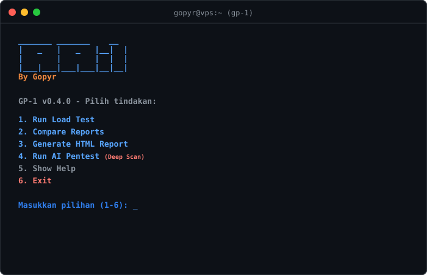

# GP-1

[](https://github.com/Gopyr/GP-1/actions)
[](https://opensource.org/licenses/MIT)

GP-1 adalah toolkit pengujian ganda (HTTP Load Testing dan AI Penetration Testing via Strix) dalam satu command-line interface (CLI). Didesain untuk developer yang butuh uji performa sekaligus audit keamanan sebelum aplikasi di-deploy ke produksi.



---

## Fitur Utama

- **CLI Menu Interaktif**: Jalankan tanpa argumen (`gp-1`) untuk masuk ke menu interaktif. Sangat mudah digunakan.
- **HTTP Load Testing**: Uji ketahanan server dengan concurrency tinggi, ticker performa real-time, dan visualisasi distribusi latensi langsung di terminal.
- **AI Penetration Testing**: Audit celah keamanan (SQL Injection, IDOR, dsb.) otomatis menggunakan AI Strix (White-Box Code Audit & Black-Box Web Scan).
- **Automated Assertions & Thresholds**: Tentukan batasan sukses (misal: p95 latency < 200ms) untuk otomatis menggagalkan pipeline CI/CD jika performa drop.
- **Rich HTML Reports**: Hasilkan laporan pengujian interaktif mandiri tanpa dependensi luar.

---

## Metode Pengujian

### 1. Load Testing (HTTP Benchmark)
Menggunakan pool worker asinkron berbasis Node.js yang sangat ringan untuk menguji kestabilan endpoint:
- **Semua HTTP Method**: GET, POST, PUT, PATCH, DELETE.
- **Kustomisasi Request**: Request body (string/file), kustom headers, Bearer token, cookies, dan Basic Auth.
- **Ramping Concurrency**: Naikkan atau turunkan beban worker secara dinamis per stage (misal: `5:10s,50:30s,5:10s`).
- **Ekspor Data**: JSON, CSV, dan NDJSON stream.

### 2. AI Pentesting (Security Scan)
Mengintegrasikan Strix AI Engine untuk melakukan audit keamanan terpandu:
- **White-Box**: Audit source code lokal untuk mendeteksi celah keamanan langsung pada baris kode.
- **Black-Box**: Scan URL target secara aktif untuk mencari celah eksploitasi.
- **Default Deep-Scan**: Menggunakan analisis mendalam bertenaga AI untuk memastikan semua celah kritis terdeteksi.

---

## Cara Penggunaan

### Mode Interaktif
Cukup jalankan tanpa argumen apa pun:
```bash
node src/cli.mjs
```

### Mode Argumen (CI/CD / Skrip)

**Load Testing Standar:**
```bash
node src/cli.mjs -u http://localhost:3000/api -d 10 -c 50
```

**Load Testing dengan Ramping (Tahapan beban):**
```bash
node src/cli.mjs -u http://localhost:3000/api -r "5:10s,50:30s,10:10s"
```

**AI Penetration Testing (Target Lokal/Direktori):**
```bash
export LLM_API_KEY="your-9router-key"
node src/cli.mjs pentest ./src --pentest-confirm
```

---

## Preview Laporan HTML

Hasil uji dapat diekspor langsung menjadi file HTML interaktif mandiri (nol dependensi luar):


---

## Disclaimer & Tanggung Jawab

GP-1 menyertakan fitur penetration testing yang kuat. Penggunaan tool ini di luar sistem lokal atau sistem yang Anda miliki secara sah berada sepenuhnya di bawah tanggung jawab Anda pribadi. Pengembang tidak bertanggung jawab atas penyalahgunaan tool ini untuk aktivitas ilegal atau tanpa izin.

## Lisensi

[MIT License](LICENSE) - Bebas digunakan dan dimodifikasi untuk kebutuhan personal maupun komersial.
