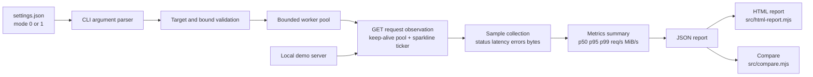

# GP-1 architecture

GP-1 keeps the measurement path compact but transport-capable: settings select a profile, the CLI validates the target and bounds, an Undici keep-alive pool serves concurrent workers, response streams are consumed for byte accounting, and the metrics layer converts observations into a versioned JSON report. v0.2.0 adds post-run HTML rendering and report comparison as pure, isolated modules.

The demo server is a separate local process. Its delay, payload size, and failure profile are explicit parameters so an experiment can state exactly what was injected. GP-1 consumes response bodies only long enough to count bytes; it does not persist bodies, perform host discovery, or coordinate distributed workers.

## Mode semantics

`mode=0` is the default observation profile. `mode=1` is a confirmed lab profile for controlled latency and fault experiments. Both profiles retain the same private-target and request-shape boundaries; mode 1 changes the documented experiment posture and defaults, not the tool into an attack mechanism.

## Live progress sparkline

During a run the CLI prints a per-second ticker with two sparklines:

- **Throughput sparkline**: requests completed in the last second, rendered with `▁▂▃▄▅▆▇█` over the last 20 seconds.
- **Latency sparkline**: mean latency of requests completed in the last second, same 20-slot window.

On TTY the ticker rewrites the current line (`\r`); on non-TTY it logs to stderr so stdout stays clean JSON. Sparklines are computed in-process with no extra I/O.

## HTML report

`src/html-report.mjs` generates a standalone HTML file with no external dependencies or network fetches. It renders config, totals, latency bars, status-code share, and errors with inline CSS. It is usable two ways:

- `gp-1 --url ... --output run.json --html run.html`: written alongside the JSON report.
- `gp-1 html run.json --output run.html`: from an existing JSON report.

A compare HTML variant (`generateCompareHtml`) renders baseline vs candidate deltas.

## Compare

`src/compare.mjs` diffs two `schemaVersion: 2` reports. It computes `delta` and `deltaPercent` for totals and latency, dictionary diffs for status codes and errors, and a short human summary. The CLI subcommand `gp-1 compare <baseline.json> <candidate.json> [--output diff.json] [--html diff.html]` prints a formatted table and optionally writes JSON/HTML diffs.

## Report contract

The report schema is versioned at `schemaVersion: 2`. It records the selected mode and profile, exact run configuration, totals, request rate, bytes received, bytes per second, MiB per second, latency summary, status-code counts, error counts, and elapsed wall-clock time. It intentionally omits response bodies and sensitive headers.
