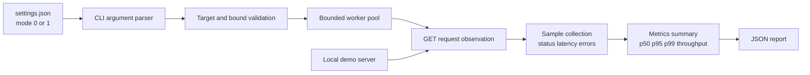

# GP-1 architecture

GP-1 keeps the measurement path intentionally small: settings select a profile, the CLI validates the target and bounds, workers issue read-only requests, and the metrics layer converts observations into a versioned JSON report.

The demo server is a separate local process. Its delay and failure profile are explicit environment variables so an experiment can state exactly what was injected. GP-1 does not collect response bodies, perform host discovery, or coordinate distributed workers.

## Mode semantics

`mode=0` is the default observation profile. `mode=1` is a confirmed lab profile for controlled latency and fault experiments. Both profiles retain the same private-target and request-shape boundaries; mode 1 changes the documented experiment posture and defaults, not the tool into an attack mechanism.

## Report contract

The report schema is versioned at `schemaVersion: 1`. It records the selected mode and profile, exact run configuration, totals, latency summary, status-code counts, error counts, and elapsed wall-clock time. It intentionally omits response bodies and sensitive headers.
